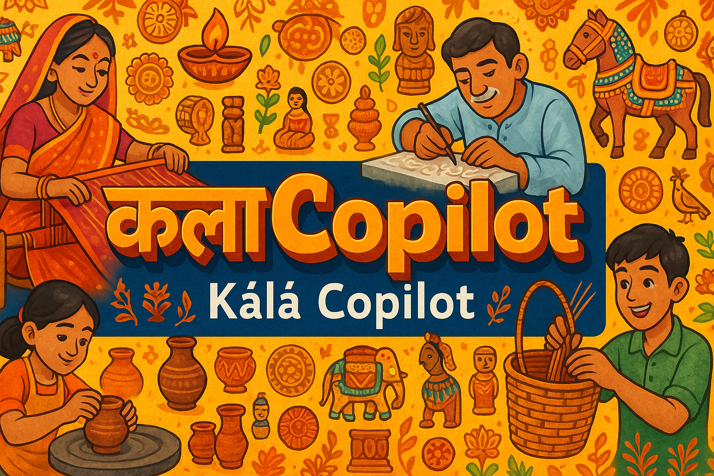

  

# कलाCopilot – Kálā Copilot
> *Kálā* (कला) means "Art" in several Indian languages.  
> **Kálā Copilot** is an AI-powered assistant that helps artisans and small business owners bring their creations online—one image, one product, one story at a time.  
>  
> **Artists create. Kálā Copilot helps them fly.**
---

## **1. Problem**

India has one of the richest networks of artisans and skilled workers—people who create beautiful, high-quality products with deep cultural value. From handwoven fabrics to woodcraft and jewelry, their creations deserve global visibility.

And while mobile internet is widely available across India, the **digital world isn’t built for them**. The language barrier is real. The platforms are overwhelming. The marketing game is unfamiliar. These creators don’t have teams, strategies, or jargon. They have talent.

Their job is to create—not to figure out how to write product descriptions, generate hashtags, or design campaigns.

This isn’t just India. Across Mexico, Southeast Asia, and even rural parts of the US, millions of creators face the same challenge:  
**the internet exists—but it doesn’t speak their language.**

In today’s world, visibility often matters more than quality.  
And without the right tools, **millions of skilled creators remain invisible**.

---

## **2. Solution: Kálā Copilot**

**Kálā Copilot** is an AI-powered assistant designed to help artisans and small business owners take their creations online—without needing to be marketers, designers, or tech-savvy.

At its core, the solution is driven by **five collaborative AI agents**, each playing a specific role:

### 1. **Onboarding Agent**  
The first interaction starts with a conversational agent that “speaks” with the user in their preferred language—asking for basic info like product category, materials used, shop name, and any past listings. This ensures a personalized and localized experience from the start.

### 2. **Visual Insight Agent**  
Once the user uploads a product photo, this agent analyzes the image to:
- Identify the object (e.g., handcrafted bag, ceramic bowl, saree)  
- Gauge the quality, size, texture, and level of craftsmanship  
- Tag relevant features like color, pattern, and utility  

### 3. **Branding Agent**  
This agent generates complete campaign-ready content:
- A compelling **product name**  
- A catchy **tagline**  
- A platform-appropriate **description** with relevant hashtags  
It adapts tone and language for different platforms like Meesho, Instagram, Etsy, etc.

### 4. **Smart Pricing Agent**  
To determine the right price, this agent scans similar products across the internet—including ecommerce platforms, local seller listings, and platform-specific trends. It balances market rates with craftsmanship to recommend a fair, competitive price.

### 5. **Publishing Agent**  
Finally, this agent compiles the output and provides ready-to-paste captions and content for the user's platform of choice. Future iterations will include direct posting integrations.

---

## **3. Who is it for?**

Kálā Copilot is designed for:

- **Artisans and skilled creators** who produce exceptional handmade goods but lack the technical or linguistic tools to market themselves online.

- **Small business owners and micro-entrepreneurs** who sell through WhatsApp, Instagram, Meesho, Etsy, or local marketplaces—but struggle to generate content, set prices, or write engaging product descriptions.

- **Digital-first sellers without access to marketing teams**, especially those in underserved regions, tier-2/3 cities, or minority-owned businesses.

**For example:**  
*Rani, a saree weaver in Bihar, spends weeks crafting a single Banarasi silk saree. But when it comes to selling online, she gets stuck—she doesn’t know what price to set, how to describe it, or what to post. With Kálā Copilot, she uploads one photo—and instantly receives a ready-to-post campaign in her language, complete with a product name, description, price, and hashtags tailored to her platform of choice.*

---

## **4. Business Relevance**

Kálā Copilot isn’t just a tool—it’s a business enabler.

By lowering the barrier to online selling, it unlocks a massive user base that has so far been underserved by the digital economy. These creators and micro-entrepreneurs represent a **huge untapped market** for ecommerce platforms, social commerce apps, and logistics players.

### Why it matters:
- **Enables platforms like Meesho, Flipkart, or Amazon India** to onboard thousands of new sellers with ready-to-use listings  
- **Creates direct value for marketplaces** by improving listing quality, discoverability, and product data structure  
- **Bridges the creator-to-customer gap**, especially in regions where marketing talent or English fluency is limited  
- **Adds multilingual and culturally localized content**, expanding reach across languages and markets  
- Can be extended to global marketplaces like **Etsy, eBay, or Meta Shops**, giving artisans from India, Mexico, and beyond the tools to go global

Kálā Copilot turns individual creators into micro-brands—without requiring them to learn marketing.  
And for platforms, it boosts growth at scale, one creator at a time.
